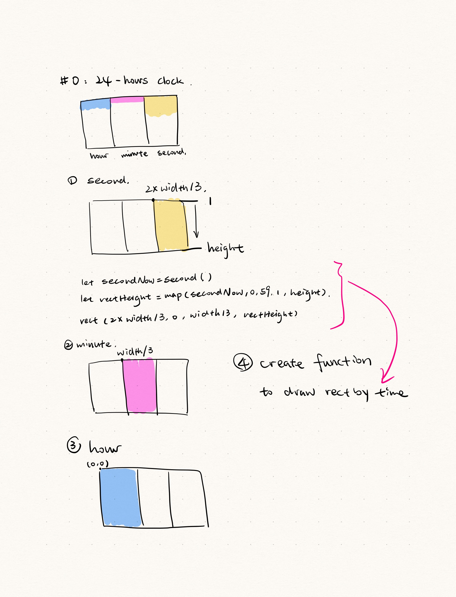

#0 file for HW04A  

Project Overview: In this project, I aim to create three variable rectangles. Each rectangle's height will be determined by the current second, minute, and hour, and these rectangles will update dynamically.

Thinking Process:  
 

Hard Part:  

I forgot to put background('beige') in function draw(), to clear the canvas each frame. So it failed to redraw a new rect when the second starts again.

Fun Part:  

It's easy to create function drawrectByTime, to make the code more clearly.